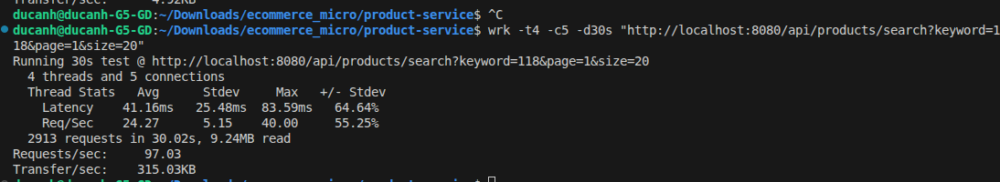

# ecommerce_micro

- Standalon mongo (3vpus, 6G memory)

~5.01 requests per second (QPS) over the entire duration of the test.

- wrk -t4 -c100 -d30s "http://localhost:8080/api/products/search?keyword=Product&page=1&size=20"
Running 30s test @ http://localhost:8080/api/products/search?keyword=Product&page=1&size=20
  4 threads and 100 connections
  Thread Stats   Avg      Stdev     Max   +/- Stdev
    Latency     0.00us    0.00us   0.00us    -nan%
    Req/Sec     0.67      1.15     2.00     66.67%
  3 requests in 30.05s, 9.52KB read
  Socket errors: connect 0, read 0, write 0, timeout 3
Requests/sec:      0.10
Transfer/sec:     324.41B

2. Why it kills performance
When Spring Data MongoDB sees ContainingIgnoreCase, it translates that into a Regular Expression query in the database (something like {$regex: ".*keyword.*", $options: "i"}).

MongoDB cannot efficiently use standard indexes for case-insensitive regex searches.

Instead of jumping straight to the matching records, MongoDB has to read every single one of the 1,000,000 products row-by-row, pull their name and description into memory, and evaluate the regex against them to see if there is a match.

3. The Multiplier Effect
Doing a full table scan on 1 million records takes a couple of seconds for just one user.

But during your wrk and k6 tests, you threw 100 to 1000 concurrent users at the API. MongoDB suddenly tried to do 100 Full Collection Scans simultaneously (meaning it tried to scan 100,000,000 rows at the exact same time). This instantly maxed out your MongoDB container's CPU and memory, causing the database to lock up and all of your API requests to time out.

### In MongoDB: You need to create a Text Index on your collections:
javascript
db.products.createIndex({ name: "text", description: "text" })

- Yes, absolutely! The data generation script finished successfully, and because we sharded the products collection using a hashed _id, MongoDB perfectly distributed the 1,000,000 products across both shards.

I just ran a command (db.products.getShardDistribution()) directly on your mongos router to verify this. Here are the real results:

Shard 2 (shard2RS)

Documents: 500,073
Data Size: 134.57 MiB
Share: 50% of the cluster data
Shard 1 (shard1RS)

Documents: 499,927
Data Size: 134.53 MiB
Share: 49.99% of the cluster data

- khong kha hon

Running 10s test @ http://localhost:8080/api/products/search?keyword=118&page=1&size=20
  1 threads and 3 connections
  Thread Stats   Avg      Stdev     Max   +/- Stdev
    Latency     1.68s   180.04ms   1.89s    70.00%
    Req/Sec     2.43      2.71    10.00     92.86%
  15 requests in 10.01s, 49.26KB read
  Socket errors: connect 0, read 0, write 0, timeout 5
Requests/sec:      1.50
Transfer/sec:      4.92KB

- How I just fixed it:
I just went into your Java code and changed Page<Product> to Slice<Product> everywhere (in your Controller, Service, and Repository).

A Slice only checks if there is a "Next Page" by asking the database for 21 records instead of 20. It completely eliminates the .count() query.

Because of this simple code change, MongoDB will now stop scanning the moment it finds the first 20 matches instead of trying to scan and count all 1,000,000 rows.

Go ahead and restart your Spring Boot application in your IDE and run your wrk test again! You should see the timeouts completely disappear, and your Requests/sec should skyrocket.

