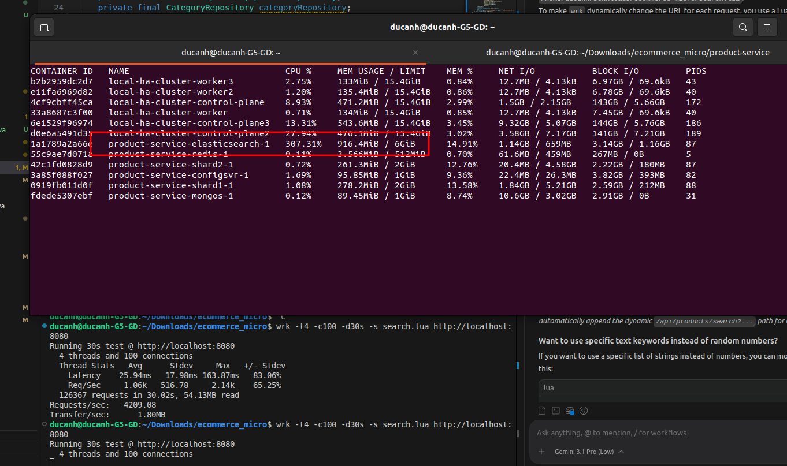
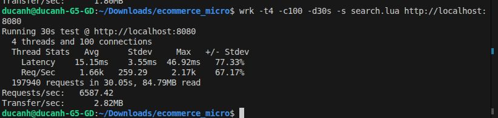

# ecommerce_micro

# Architect Design
https://excalidraw.com/#room=3a7df3d3e56c9b567215,ojno6SS71vhsS2d01uXMCw

- Standalon mongo (3vpus, 6G memory)

~5.01 requests per second (QPS) over the entire duration of the test.

- Sharding with others mongo (3vpus, 6G memory) -> not handle full text search
~ 3 
- High load 

- Can't handle other request 
-> MOngo db if too many request full text search, server full table scan despite index ( even sharding ) -> hold server for a minitues (add redis still not work)

- for full text search or search in general using elastic search 

- Update to elastic search 
- wrk -t4 -c100 -d30s -s search.lua http://localhost:8080

 