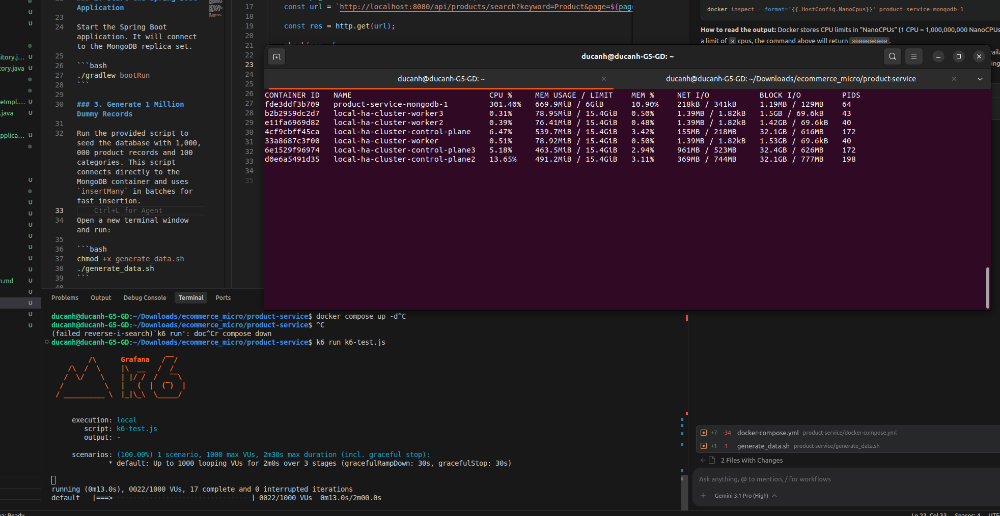
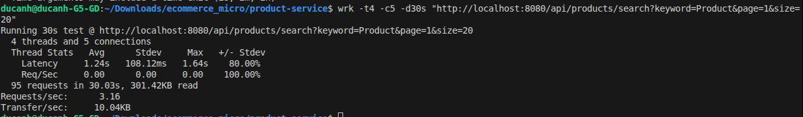

# ecommerce_micro

- Standalon mongo (3vpus, 6G memory)

~5.01 requests per second (QPS) over the entire duration of the test.

- wrk -t4 -c100 -d30s "http://localhost:8080/api/products/search?keyword=Product&page=1&size=20"
Running 30s test @ http://localhost:8080/api/products/search?keyword=Product&page=1&size=20
  4 threads and 100 connections
  Thread Stats   Avg      Stdev     Max   +/- Stdev
    Latency     0.00us    0.00us   0.00us    -nan%
    Req/Sec     0.67      1.15     2.00     66.67%
  3 requests in 30.05s, 9.52KB read
  Socket errors: connect 0, read 0, write 0, timeout 3
Requests/sec:      0.10
Transfer/sec:     324.41B

2. Why it kills performance
When Spring Data MongoDB sees ContainingIgnoreCase, it translates that into a Regular Expression query in the database (something like {$regex: ".*keyword.*", $options: "i"}).

MongoDB cannot efficiently use standard indexes for case-insensitive regex searches.

Instead of jumping straight to the matching records, MongoDB has to read every single one of the 1,000,000 products row-by-row, pull their name and description into memory, and evaluate the regex against them to see if there is a match.

3. The Multiplier Effect
Doing a full table scan on 1 million records takes a couple of seconds for just one user.

But during your wrk and k6 tests, you threw 100 to 1000 concurrent users at the API. MongoDB suddenly tried to do 100 Full Collection Scans simultaneously (meaning it tried to scan 100,000,000 rows at the exact same time). This instantly maxed out your MongoDB container's CPU and memory, causing the database to lock up and all of your API requests to time out.

### In MongoDB: You need to create a Text Index on your collections:
javascript
db.products.createIndex({ name: "text", description: "text" })

